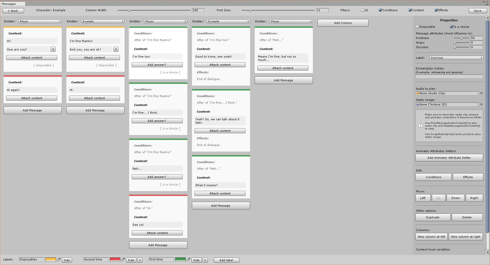

# Diplomata

 

Diplomata is a Unity multi language dialogues content management system and editor extension inspired by [Twine](http://twinery.org/), like [Fungus](http://fungusgames.com/) and [Yarn / Yarn Spinner](https://github.com/InfiniteAmmoInc/Yarn), but **is not node based**.  

Diplomata manage optionally other contents of a game like characters, inventory, quests, animations and sprites.

Idealized for screenwriters, game designers, programmers and hobbyist writers, to configure and apply dialogues in any type of game.

---

**Features:**
- Text edition in an organized environment split by characters and contexts.
- Manage characters, contexts, and messages separately from the scene objects.
- Add multiple languages for your game.
- Fuzzy logic system to influence organically the characters with custom attributes.
- Use colors in the message cards to organize your messages in your own way.
- All text and preferences are saved in json files, making it easy to use external tools.
- Export text to screenplay format for actors understand the story.
- Use templates or create your own. (In development)
- Internal system to save and load game progress, you can use as is or side by side with your own persistence system.
- Choose and manage audio files to play when message show, taking into account the configured language.
- Manage animator attributes in any message.
- Choose and manage sprites to show in every message.
- Inventory integration with title and description in multiple languages.
- Create custom flags to authoring your game progress.

---

**License:**

All files in this repository is licensed under a [MIT License](https://github.com/lavaleak/diplomata/blob/master/LICENSE.md).
